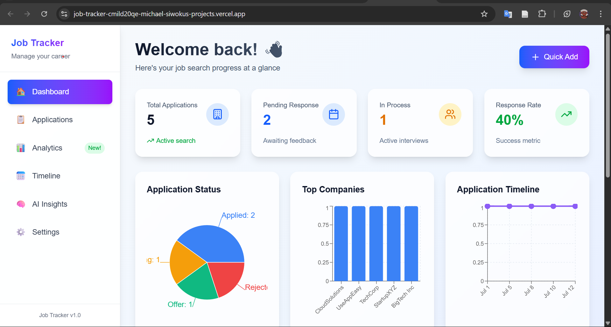

# 🚀 Job Tracker - Modern Career Management Dashboard

> A beautiful, responsive web application for tracking job applications with AI-powered insights and comprehensive analytics.

[](https://nextjs.org/)
[](https://www.typescriptlang.org/)
[](https://tailwindcss.com/)
[](https://developer.mozilla.org/en-US/docs/Learn/CSS/CSS_layout/Responsive_Design)
[](https://job-tracker-cmild20qe-michael-siwokus-projects.vercel.app/)

## 🌐 Live Demo

**🚀 [Try the Live Application](https://job-tracker-cmild20qe-michael-siwokus-projects.vercel.app/)**

Experience the full responsive design across all your devices!

## 📸 Screenshots

### 🖥️ Desktop Dashboard

*Professional dashboard with comprehensive analytics and beautiful glass morphism design*

### 📊 Key Features Showcase
- **Responsive Analytics**: Interactive charts that adapt to all screen sizes
- **Real-time Data**: Live application tracking with visual progress indicators  
- **Touch-Optimized**: Perfect mobile experience with intuitive navigation
- **Modern UI**: Glass morphism effects with smooth animations

### 📱 Mobile Experience
The application seamlessly adapts from desktop to mobile with:
- Collapsible navigation with hamburger menu
- Touch-friendly interface elements
- Optimized card layouts for mobile screens
- Fixed action buttons for easy access

> 📱 **Test Responsiveness**: Visit the [live demo](https://job-tracker-cmild20qe-michael-siwokus-projects.vercel.app/) and resize your browser or test on mobile devices to see the responsive design in action!

## ✨ Features

### 📱 **Mobile-First Responsive Design**
- **Adaptive Layout**: Seamlessly transitions from mobile (320px) to desktop (1920px+)
- **Touch-Optimized**: All interactions designed for mobile devices
- **Progressive Enhancement**: Enhanced features on larger screens
- **Cross-Device Sync**: Consistent experience across all devices

### 🎯 **Core Functionality**
- **Application Tracking**: Manage job applications with status updates
- **Timeline View**: Chronological visualization of your job search journey
- **Analytics Dashboard**: Comprehensive insights with conversion rates and trends
- **AI-Powered Insights**: Get personalized career advice and analysis
- **Smart Notifications**: Follow-up reminders and progress tracking

### 🎨 **Modern UI/UX**
- **Glass Morphism Design**: Beautiful backdrop blur effects
- **Smooth Animations**: Micro-interactions and transitions
- **Dark/Light Theme**: System preference detection
- **Accessibility First**: WCAG compliant with keyboard navigation

## 📱 Responsive Design Highlights

### Mobile (320px - 768px)
- **Collapsible Navigation**: Hamburger menu with smooth transitions
- **Card-Based Layout**: Touch-friendly interface elements
- **Stacked Content**: Vertical layout optimization
- **Fixed Action Buttons**: Easy access to primary actions

### Tablet (768px - 1024px)
- **Hybrid Layout**: Best of mobile and desktop experiences
- **Grid Adaptations**: 2-column layouts where appropriate
- **Enhanced Touch Targets**: Optimized for tablet interactions

### Desktop (1024px+)
- **Multi-Column Layouts**: Efficient use of screen real estate
- **Sidebar Navigation**: Persistent navigation for quick access
- **Advanced Visualizations**: Detailed charts and analytics
- **Keyboard Shortcuts**: Power user features

## 🛠️ Tech Stack

**Frontend Framework**
- [Next.js 14](https://nextjs.org/) - React framework with App Router
- [TypeScript](https://www.typescriptlang.org/) - Type-safe JavaScript
- [Tailwind CSS](https://tailwindcss.com/) - Utility-first CSS framework

**UI & Styling**
- [Lucide React](https://lucide.dev/) - Beautiful SVG icons
- [Headless UI](https://headlessui.com/) - Unstyled, accessible components
- Custom responsive breakpoints and animations

**Data & State**
- Local Storage for persistence
- React Hooks for state management
- TypeScript interfaces for type safety

**Development Tools**
- ESLint & Prettier for code quality
- Responsive design testing tools
- Performance optimization

## 🚀 Getting Started

### Prerequisites
- Node.js 18.0 or later
- npm, yarn, pnpm, or bun

### Installation

1. **Clone the repository**
```bash
git clone https://github.com/yourusername/job-tracker.git
cd job-tracker
```

2. **Install dependencies**
```bash
npm install
# or
yarn install
# or
pnpm install
```

3. **Run the development server**
```bash
npm run dev
# or
yarn dev
# or
pnpm dev
```

4. **Open your browser**
```
http://localhost:3000
```

### Building for Production

```bash
# Build the application
npm run build

# Start production server
npm start
```

## 📄 Pages Overview

### 🏠 **Dashboard**
- **Overview Cards**: Quick stats and metrics with real-time updates
- **Recent Activity**: Latest application updates with visual timeline
- **Action Items**: Pending tasks and follow-up reminders
- **Quick Actions**: Fast access to common features with one-click access

### 📋 **Applications**
- **Application List**: Searchable and filterable job list with advanced sorting
- **Status Management**: Easy status updates with visual indicators
- **Bulk Operations**: Select and update multiple applications efficiently
- **Export/Import**: Data portability features for backup and migration

### 📊 **Analytics**
- **Conversion Rates**: Application → Interview → Offer metrics with detailed breakdown
- **Timeline Analysis**: Weekly and monthly application trends with interactive charts
- **Company Insights**: Performance by company with success rate analysis
- **Success Metrics**: Overall job search effectiveness with actionable insights

### 🤖 **AI Insights**
- **Career Analysis**: AI-powered recommendations based on your application data
- **Application Review**: Feedback on application strategy and optimization tips
- **Market Trends**: Industry and role insights with data-driven advice
- **Interview Prep**: Personalized preparation tips for upcoming interviews

### 📅 **Timeline**
- **Chronological View**: Visual timeline of all activities with interactive events
- **Event Details**: Expandable event information with rich context
- **Status Tracking**: Visual progression through application stages
- **Quick Actions**: Direct actions from timeline events for efficient workflow

### ⚙️ **Settings**
- **Profile Management**: User preferences and personal information
- **Notification Settings**: Customizable alerts and reminder preferences
- **Data Management**: Export, import, and backup options for data portability
- **Appearance**: Theme and display preferences with system detection

## 📱 Responsive Features

### **Breakpoint Strategy**
```css
/* Mobile First Approach */
/* Base styles: 320px+ */
sm: 640px   /* Small tablets and large phones */
md: 768px   /* Tablets */
lg: 1024px  /* Small laptops */
xl: 1280px  /* Desktops */
2xl: 1536px /* Large screens */
```

### **Key Responsive Patterns**
- **Flexible Grid Systems**: CSS Grid and Flexbox layouts that adapt seamlessly
- **Adaptive Typography**: Responsive text scaling for optimal readability
- **Touch Targets**: Minimum 44px touch targets on mobile for accessibility
- **Progressive Disclosure**: Show more details on larger screens progressively
- **Contextual Navigation**: Different navigation patterns optimized per device

## 🎨 Design System

### **Color Palette**
```css
Primary: Blue (#3B82F6) - Action items and links
Secondary: Purple (#8B5CF6) - Accent elements
Success: Green (#10B981) - Positive actions
Warning: Amber (#F59E0B) - Attention items
Error: Red (#EF4444) - Error states
Neutral: Slate (#64748B) - Text and backgrounds
```

### **Typography Scale**
- **Headings**: Responsive scale from 1.5rem to 3rem
- **Body Text**: 0.875rem to 1rem based on screen size
- **Captions**: 0.75rem to 0.875rem for secondary info

### **Spacing System**
- **Mobile**: Compact spacing for efficient use of space
- **Tablet**: Balanced spacing for comfortable interaction
- **Desktop**: Generous spacing for visual hierarchy

## 🔧 Development

### **Project Structure**
```
src/
├── app/                    # Next.js App Router pages
│   ├── analytics/         # Analytics dashboard
│   ├── ai-insights/       # AI-powered insights
│   ├── applications/      # Job applications management
│   ├── settings/          # User preferences
│   └── timeline/          # Application timeline
├── components/            # Reusable UI components
├── types/                 # TypeScript type definitions
└── utils/                 # Utility functions
```

### **Key Components**
- **AddJobForm**: Responsive form for adding/editing applications
- **Navigation**: Adaptive navigation for all screen sizes
- **StatusBadge**: Consistent status indicators
- **ResponsiveChart**: Charts that adapt to container size

### **Performance Optimizations**
- **Image Optimization**: Next.js Image component with responsive loading
- **Code Splitting**: Automatic code splitting with Next.js
- **CSS Optimization**: Tailwind CSS purging for minimal bundle size
- **Lazy Loading**: Components and images load as needed

## 📊 Browser Support

- **Chrome/Edge**: 88+ (Excellent)
- **Firefox**: 85+ (Excellent) 
- **Safari**: 14+ (Excellent)
- **Mobile Safari**: 14+ (Excellent)
- **Chrome Mobile**: 88+ (Excellent)

## 🚀 Deployment

### **Vercel (Recommended)**
```bash
# Install Vercel CLI
npm i -g vercel

# Deploy
vercel
```

### **Netlify**
```bash
# Build the project
npm run build

# Upload the 'out' folder to Netlify
```

### **Manual Deployment**
```bash
# Build for production
npm run build

# Serve the build files
npm start
```

## 🤝 Contributing

1. Fork the repository
2. Create a feature branch (`git checkout -b feature/amazing-feature`)
3. Commit your changes (`git commit -m 'Add amazing feature'`)
4. Push to the branch (`git push origin feature/amazing-feature`)
5. Open a Pull Request

## 📝 License

This project is licensed under the MIT License - see the [LICENSE](LICENSE) file for details.

## 🎯 Future Enhancements

- [ ] **Real-time Sync**: Multi-device synchronization
- [ ] **Advanced Analytics**: Machine learning predictions
- [ ] **Team Features**: Collaboration and sharing
- [ ] **Mobile App**: React Native companion app
- [ ] **API Integration**: Job board integrations
- [ ] **Advanced AI**: GPT-4 powered insights

## 📞 Contact

**Your Name** - [your.email@example.com](mailto:your.email@example.com)

**Project Link** - [https://github.com/yourusername/job-tracker](https://github.com/yourusername/job-tracker)

**Live Demo** - [https://job-tracker-demo.vercel.app](https://job-tracker-demo.vercel.app)

---

<div align="center">
  <p>⭐ Star this repo if you find it helpful!</p>
  <p>Built with ❤️ and modern web technologies</p>
</div>
